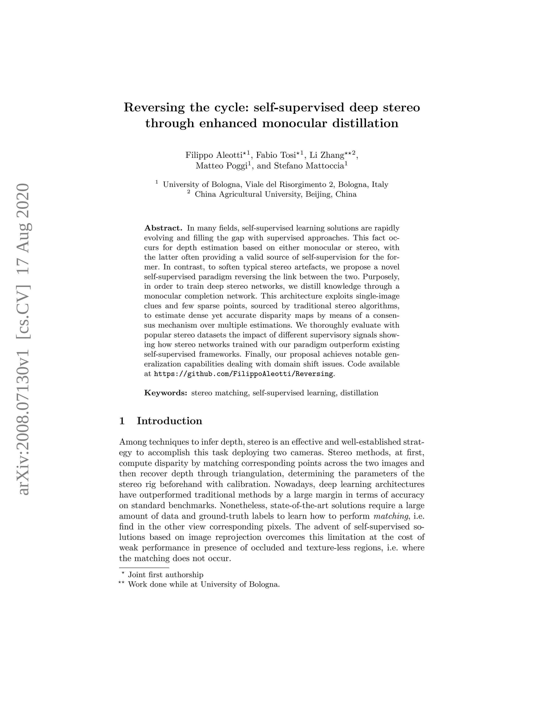
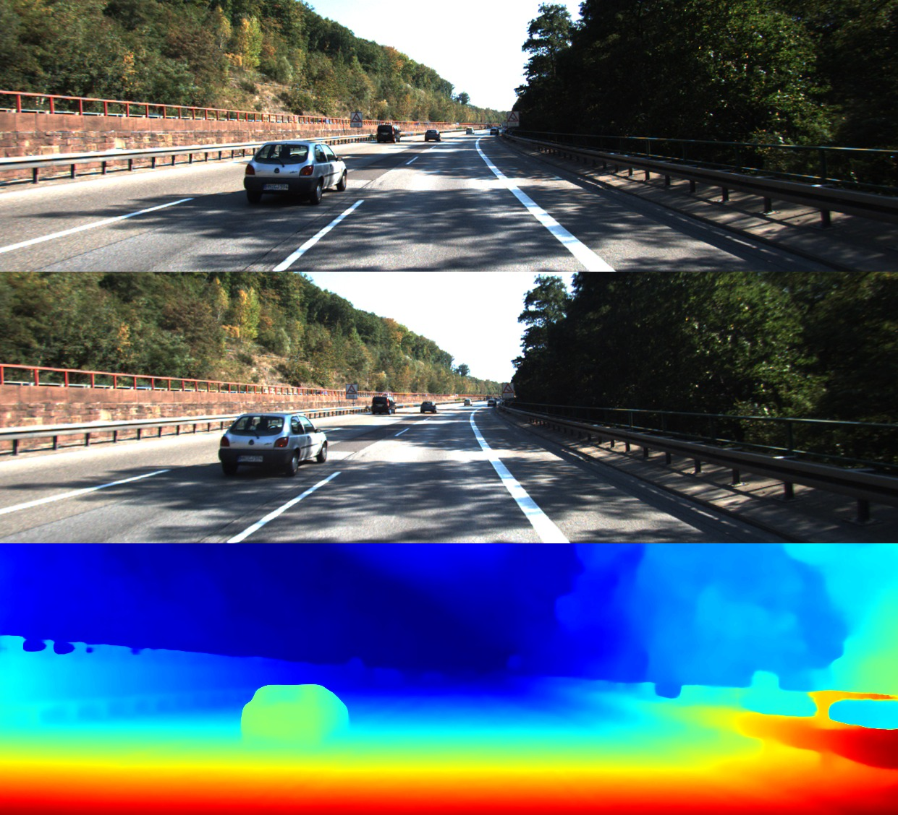
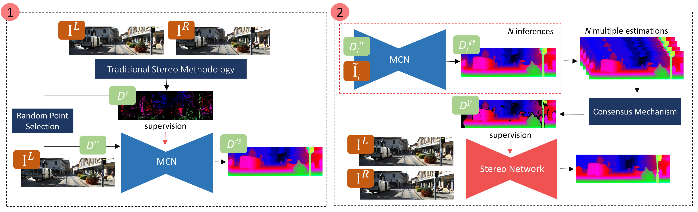

# Reversing the cycle

Code for "Reversing the cycle: self-supervised deep stereo through enhanced monocular distillation"

[Filippo Aleotti](https://filippoaleotti.github.io/website), [Fabio Tosi](https://vision.disi.unibo.it/~ftosi/), [Li Zhang](), [Matteo Poggi](https://mattpoggi.github.io/), [Stefano Mattoccia](http://vision.deis.unibo.it/~smatt/Site/Home.html)

<p align="center">
  
| Paper | Short Video | Long Video |
|:---: |:---:| :---:|
| <a href="https://arxiv.org/pdf/2008.07130.pdf">  </a> | <a href="https://drive.google.com/file/d/1u4b0XTQSglaBnnHGzNl-6Pmwe18ZZilT/view?usp=sharing">  </a> | <a href="https://drive.google.com/file/d/1V1vrMtEw6uy3TfAW0wXlc-zxxsuIlJY2/view?usp=sharing">  |

</p>


## Citation

```
@inproceedings{aleotti2020reversing,
  title={Reversing the cycle: self-supervised deep stereo through enhanced monocular distillation},
  author={Aleotti, Filippo and Tosi, Fabio and Zhang, Li and Poggi, Matteo and Mattoccia, Stefano},
  booktitle = {16th European Conference on Computer Vision (ECCV)},
  year={2020},
  publisher={Springer}
}
```

# Abstract
In many fields, self-supervised learning solutions are rapidly evolving and filling the gap with supervised approaches. This fact occurs for depth estimation based on either monocular or stereo, with the latter often providing a valid source of self-supervision for the former.
In contrast, to soften typical stereo artefacts, we propose a novel self-supervised paradigm reversing the link between the two. Purposely, in order to train deep stereo networks, we distill knowledge through a monocular completion network. This architecture exploits single-image clues and few sparse points, sourced by traditional stereo algorithms, to estimate dense yet accurate disparity maps by means of a consensus mechanism over multiple estimations. We thoroughly evaluate with popular stereo datasets the impact of different supervisory signals showing how stereo networks trained with our paradigm outperform existing self-supervised frameworks. Finally, our proposal achieves notable generalization capabilities dealing with domain shift issues.



From top to bottom, the left image, the right image and the predicted disparity map. No ground-truths or LiDaR data have been used to train the network.

# Framework



# Settings
Code tested using PyTorch 1.0.1 and python 3.x., using a single GPU.
Requirements can be installed using the following script:

```
pip install -r requirements
```

# Train
To replicate the pipeline, you have to:
1. generate stereo labels with traditional algorithms
2. train the Monocular Completion Network (MCN) using such labels
3. Generate the proxy labels for the stereo network using the Consensus Mechanism
4. Train the stereo network on the proxy labels created in (3)

### Generate stereo labels from traditional algorithms

To create the initial stereo labels for training MCN, we used the [code](https://github.com/fabiotosi92/Unsupervised-Confidence-Measures) of the paper 
"Learning confidence measures in the wild", by F. Tosi, M. Poggi, A. Tonioni, L. Di Stefano and S. Mattoccia.

Once compiled, you can generate stereo labels for a given pair with the command:

```
./build/bmvc2017 -l [left_image] -r [right_image] -o [output_path] \
                 -p da ds lrc apkr dsm uc med \
                 -n da ds lrc apkr uc \ 
                 -t 0.4 -b 1 -d 192
```

### Train the Monocular Completion Network
We used [MonoResMatch](https://arxiv.org/pdf/1904.04144.pdf) as monocular network, changing the network to accept also sparse stereo points as input.
Original code of the network can be found [here](https://github.com/fabiotosi92/monoResMatch-Tensorflow).
Since the original network has been developed using TensorFlow, we used the same framework to train our MCN.

You can install MCN requirements in a new python 3 environment:
```
cd mono
pip install -r requirements.txt
```
*Notice that at this point we use TensorFlow 1.10, while in the Stereo section we need TensorFlow 2.0. This difference is motivated by the automatic execution of TensorBoard in the stereo training, however you can disable it and use TensorBoard 1.10 even for the last stage.*

Then,
```
python main.py --is_training \
               --data_path_image $path_full_kitti \
               --data_path_proxy $path_proxy \
               --batch_size $batch_size \
               --iterations $iterations \
               --patch_width $patch_width \
               --patch_height $patch_height \
               --initial_learning_rate $initial_learning_rate \
               --filenames_file $file_training \
               --learning_rate_schedule $learning_rate_schedule \
               --log_directory $log_directory \
               --width $width --height $height
```

where:
* `is_training`: training flag. Add it in case of training
* `data_path_image`: path to RGB dataset
* `data_path_proxy`: path to traditional stereo proxies
* `patch_height`: width of crop used a training time
* `patch_width`: height of crop used a training time
* `batch_size`: batch size
* `iterations`: number of training steps
* `learning_rate_schedule`: milestones in which the learning rate has to change
* `initial_learning_rate`: initial value of learning rate
* `filenames_file`: path to training txt files with names
* `log_directory`: where checkpoints will be saved
* `width`: width of images after initial resize
* `height`: height of images after initial resize

You can test the single inference MCN using the test scripts:

```
python main.py  --output_path $output_path \
                --data_path_image $path_to_KITTI/2015/training \
                --data_path_proxy $path_proxy \
                --filenames_file "./utils/filenames/kitti_2015_test" \
                --checkpoint_path $checkpoint_path \
                --width 1280 --height 384 \
                --number_hypothesis -1
cd ..
python test/kitti.py --prediction $output_path --gt $path_to_KITTI/2015/training
```

where:
* `output_path`: where the filtered proxies will be saved
* `data_path_image`: path to RGB dataset
* `path_proxy`: path to traditional stereo proxies. You can use WILD again or a different method (e.g., SGM)
* `filenames_file`: path to dataset filename file
* `checkpoint_path`: path to pre-trained MCN
* `width`: width of resized image
* `height`: height of resized image
* `number_hypothesis`: number of multiple inferences. If `-1`, do not apply the consensus mechanism, and save the single prediction of the network
* `input_points`: percentage of traditional stereo points given as input to the network. Default is `0.95`

In this case the model takes few random stereo points as input and it does not apply the consensus mechanism over multiple inferences.
To test the MCN with consensus mechanism, apply multiple inferences over the testing split and change the testing code, masking out not only ground-truth invalid points but also invalid points in predictions.

### Generate the proxy labels for the stereo network using the Consensus Mechanism


You can generate the monocular proxies by running the consensus mechanism over multiple predictions. To obtain these proxies, you have to run the same script used to test MCN changing just some parameters.

```
python main.py  --output_path $output_path \
                --data_path_image $data_path_image  \
                --data_path_proxy $path_proxy \
                --filenames_file $filenames_file \
                --checkpoint_path $checkpoint_path \
                --width $width --height $height \
                --output_path $output_folder \
                --number_hypothesis $n \
                --temp_folder $temp
```
where:
* `number_hypothesis`: number of multiple inferences. If `-1`, do not apply the consensus mechanism, and save the single prediction of the network
* `temp`: temporary directory that contains multiple inferences
* `right`: flag. To generate right images (e.g., for KITTI is `image_03`) and not left (`image_02` on KITTI)

For instance, to generate proxies for KITTI train dataset, the script is:

```
python main.py  --output_path $output_path \
                --data_path_image $data_path_image  \
                --data_path_proxy $path_proxy \
                --filenames_file "./utils/filenames/kitti_2015_train.txt" \
                --checkpoint_path $checkpoint_path \
                --width 1280 --height 384 \
                --output_path $output_folder \
                --number_hypothesis 25 \
                --temp_folder kitti_temp
```
**NOTE:** if `number_hypothesis` > 0, then at each step we make a prediction both for the original and the flipped image. This means that with `number_hypothesis` == 25 you will obtain 50 images (that is, 50% changes of flip the image).

### Train the stereo network
At this point, you can train the stereo network on the monocular proxies.

```
cd stereo
python main.py --mode train --model $model --epoch $epochs --milestone $milestone \
               --datapath $datapath --dataset $dataset \
               --proxy $proxy_path \
               --crop_w $w --crop_h $h --batch $batch \
               --loss_weights=$loss_weights
```

where:
* `model`: architecture to train. Choices are [`psm`, `iresnet`, `stereodepth`, `gwcnet`]
* `epoch`: number of training epochs
* `dataset`: training dataset. Choices are [`KITTI`, `DS`]
* `crop_w`: width of the cropped image
* `crop_h`: height of the cropped image
* `batch`: batch size
* `milestone`: epoch in which the learning rate has to change
* `datapath`: path to rgb images
* `proxy`: path to proxies
* `loss_weights`: weights of scales. Sequence comma separated, e.g. `0.2,0.6,1.0`
* `maxdisp`: maximum disparity. Default is `192`
* `rgb_ext`: extension of rgb images. Default is `.jpg`

For instance, to train `psm` the command is:

```
python main.py --mode train --model psm --epoch 11 --milestone 8 \
               --datapath $datapath --dataset KITTI \
               --proxy $proxy_path \
               --crop_w 640 --crop_h 192 --batch 2 \
               --loss_weights=0.2,0.6,1.0 \
               --maxdisp 192
```
# Test

Pretrained models are available for download:

| Network | KITTI |
|:--:|:--:|
| PSMNet | [weights](https://drive.google.com/file/d/1J1_VMQd2KmSJINwt6Ejuhi6Q6F8usOYm/view?usp=sharing) |
| IResNet | [weights](https://drive.google.com/file/d/1HjkUiHRV9MPcZDVWdWxRHpaIHcPkSRbA/view?usp=sharing) |
| Stereodepth | [weights](https://drive.google.com/file/d/1TsHrHFLXK-lDmINdZXOiOM0TCiNEAA4E/view?usp=sharing) |
| GwcNet | [weights](https://drive.google.com/file/d/1E83Cu1eF_tTShbjlG-b8_K3tgasU_tVy/view?usp=sharing) |
| MCN | [weights](https://drive.google.com/file/d/131VTA4uBLTsR1bBzQ9XOeIiPW3IOnk7Q/view?usp=sharing) |

## KITTI
You can test them running a command like this:

```
python main.py --mode "test" --model $model \
                --gpu_ids $gpu \
                --datapath $data \
                --ckpt $ckpt \
                --results $results_dir \
                --qualitative \
                --final_h 384 \
                --final_w 1280
```

where:

* `model`: network architecture. Options are [`psm`, `iresnet`, `stereonet`, `gwcnet`]
* `gpu_ids`: gpu index. Default is `0`
* `datapath`: path to images
* `ckpt`: path to pre-trained model
* `results`: where results will be saved
* `qualitative`: save also colored maps
* `final_h`: height of image after padding
* `final_w`: width of image after padding

Then, you can test disparities using the testing script:

```
python test/kitti.py --prediction $result/16bit/$model/KITTI --gt $path
```

where:
* `prediction`: path to 16 bit disparities predicted by the model
* `gt`: path to `KITTI/2015/training` on your machine

# Middlebury
You can generate and test artifacts on Middlebury (at quarter resolution) running the command:

```
cd stereo
python main.py --mode "test" --model $model \
                --gpu_ids 0 \
                --maxdisp 192  \
                --dataset "MIDDLEBURY" \
                --ckpt $ckpt  \
                --datapath $datapath \
                --results "./results" \
                --final_h 512 \
                --final_w 1024
cd ..
python test/middlebury.py --prediction stereo/results/16bit/$model/MIDDLEBURY --gt $gt
```

where:
* `gt`: path to MiddleburyTrainingQ folder (the script looks for `pfm` ground-truth)

# ETH3D
You can generate and test artifacts on ETH3D running the command:

```
cd stereo
python main.py --mode "test" --model $model \
                --gpu_ids 0 \
                --maxdisp 192  \
                --dataset "ETH3D" \
                --ckpt $ckpt  \
                --datapath $datapath \
                --results "./results" \
                --final_h 512 \
                --final_w 1024
cd ..
python test/eth.py --prediction stereo/results/16bit/$model/ETH3D --gt $gt
```

where:
* `gt`: path to ETH3D/training folder (the script looks for `pfm` ground-truth)

# Single inference
You can run the network on a single stereo pair, or eventually on a list of pairs, using the following script:

```
python single_shot.py --left $left --right $right \
                      --model $model --ckpt $ckpt \
                      --maxdisp 192 \
                      --qualitative --cmap $map \
                      --final_h 384 \
                      --final_w 1280 \
                      --results $result_dir \
                      --gpu_ids 0 \
                      --maxval $maxval
```

where:
* `left`: list (space separated) of paths to left images
* `right`: list (space separated) of paths to right images
* `ckpt`: path to checkpoint
* `maxdisp`: maximum disparity value. Default `192`
* `qualitative`: if add, save prediction using a colormap. Otherwise, save 16 bit png image
* `cmap`: select the colormap to apply in case of qualitative. Choices are [`kitti`, `magma`, `jet`, `gray`]
* `final_h`: height of image after padding
* `final_w`: width of image after padding
* `results`: folder where predictions will be saved. If not exists, it will be created
* `gpu_ids`: index of gpu to use
* `maxval`: optional. For KITTI colormap, you can set even maxval. Default `-1`

# Acknowledgment

We thank the authors that shared the code of their works. In particular:
* Jia-Ren Chang and for providing the [code](https://github.com/JiaRenChang/PSMNet) of [PSMNet](https://arxiv.org/abs/1803.08669).
* Clément Pinard for his [PyTorch implementation](https://github.com/ClementPinard/FlowNetPytorch) of FlowNet, and the data augmentation functions.
* Xiaoyang Guo et al. for providing the [code](https://github.com/xy-guo/GwcNet) of [GWCNet](https://arxiv.org/pdf/1903.04025).
* Clément Godard et al. for providing the [code](https://github.com/nianticlabs/monodepth2) of [Monodepth2](https://arxiv.org/abs/1806.01260), and the KITTI evaluation code used in [Monodepth](https://github.com/mrharicot/monodepth).
